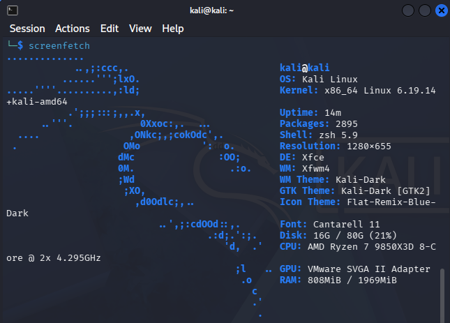
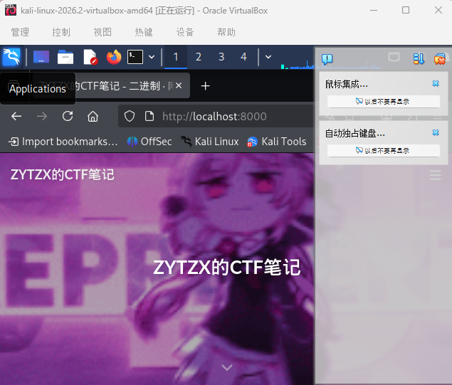

跟GPT抄作业搭建的虚拟机，
下载screenfetch！

跟着GPT复制代码就下载咧。
---
打开博客！

对虚拟机文件网络进行设置，将端口转发里的主机和子系统端口都设置8080就可以用主机打开咧，为什么呢我也不知道，以后再说吧。
---
Linux命令
ls          # 查看目录
cd          # 切换目录
pwd         # 查看当前位置
git clone   # 下载代码
python3 -m http.server  # 启动服务器
sudo apt    # 安装软件
---
Markdown！
1.
# 文章标题
## 一、题目描述
## 二、解题过程
### 1. 信息搜集
### 2. 漏洞分析
## 三、Flag
2.
**重要内容**
__重要内容__
3.
*斜体*
4.
~~错误内容~~
5.
- 无序内容
* 无序内容
6.
`行内代码`
```c
语法高亮
#include 
7.
> 引用
8.
分割线
---
manpage 就是 Linux 的“官方使用说明书”
man 是 manual（手册） 的缩写
q可以退出man
man 命令或许能帮助理解不会的Linux命令